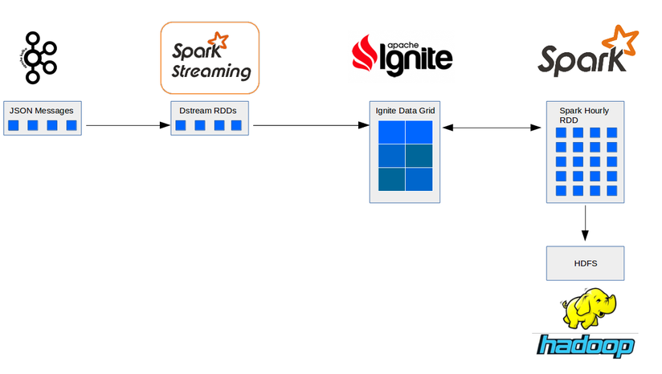

# Spark + Ignite: An architecture for fast querying and storage of IoT data 

## Overview

In  this project, I present a simple architecture which uses Apache Spark and Ignite, in order to process and store data from the Newcastle University's Urban Observatory (http://uoweb1.ncl.ac.uk/).  
Because we are dealing with data that may arrive in mere second intervals, and if we want to detect anomalies or patterns quickly enough to take action, then an in-memory database is the way to go. 

You can check the architecture schema below.

For a more detailed description for this project, please go to https://manuelmourato25.github.io/

## Requirements

* Apache Spark 2.2.0
* Apache Ignite 2.2.0
* Apache Kafka 0.8
* Apache Ignite Spark Module
* Scala 2.10.6
* SBT

## Steps

* Ingestion step:

1. Start a Kafka server and create a topic as described [here](https://kafka.apache.org/quickstart#quickstart_createtopic)
2. Get an API key from the Urban Observatory
3. Execute `python  IngestData.py $API_KEY`

* Processing and Storing in memory step:
 1. Start an Ignite server with `./ignite.sh` 
 2. Go inside the `SensorProcessing` dir and execute `sbt run` . Define any confs you might have in the SparkContext from script `SensorDataProcessing.scala`
 

* Persisting data and clearing cache
 1.  Go inside the `SparkHourlyProcess` dir and change the `SensorDataProcessing.scala` script so that it saves your data o a desired folder.   
 2. Go inside the `SparkHourlyProcess` dir and execute `sbt run` . Define any confs you might have in the SparkContext from script `SensorDataProcessing.scala`

 
